# Implementation Plan: ndots Admission Controller

This document outlines the implementation plan for the Kubernetes Mutating Admission Controller that sets Pod `dnsConfig.ndots` values.

## Overview

Build a production-ready MutatingAdmissionWebhook that:
- Sets `ndots` DNS option in `Pod.spec.dnsConfig.options`
- Supports annotation-based opt-in/opt-out (`change-ndots: "true"/"false"`)
- Provides configurable modes: `always`, `opt-in`, `opt-out`
- Deploys via Helm chart with cert-manager or self-signed TLS support

---

## Development Methodology: Test-Driven Development (TDD)

> [!IMPORTANT]
> **All implementation MUST follow TDD principles: Write tests FIRST, then implement.**

### TDD Cycle (Red-Green-Refactor)

```mermaid
graph LR
    R[🔴 Red: Write failing test] --> G[🟢 Green: Write minimal code to pass]
    G --> RF[🔵 Refactor: Clean up code]
    RF --> R
```



### TDD Rules for This Project

1. **Write the test first** - Before writing any production code, write a failing test
2. **One test at a time** - Focus on one behavior, get it passing, then move on
3. **Minimal implementation** - Write only enough code to make the test pass
4. **Refactor with confidence** - Tests provide safety net for improvements
5. **Tests are documentation** - Tests describe expected behavior

### Task Structure (TDD Format)

Each implementation task follows this structure:

```
1. Define interfaces/types (contracts)
2. Write unit tests for expected behavior
3. Run tests (should FAIL - Red)
4. Implement minimal code to pass tests
5. Run tests (should PASS - Green)
6. Refactor if needed
7. Repeat for next behavior
```

---

## Phase 1: Core Foundation

> **Goal**: Establish project structure and minimal working webhook

### Task 1.1: Project Scaffolding
- [docs/tasks/01-project-scaffolding.md](./tasks/01-project-scaffolding.md)
- Initialize Go module, directory structure, Makefile, Dockerfile
- **Estimate**: 1-2 hours

### Task 1.2: Webhook Server Implementation
- [docs/tasks/02-webhook-server.md](./tasks/02-webhook-server.md)
- HTTP server with TLS, health endpoints, graceful shutdown
- **Estimate**: 2-3 hours

### Task 1.3: Admission Handler Core
- [docs/tasks/03-admission-handler.md](./tasks/03-admission-handler.md)
- Parse AdmissionReview, decode Pod, return basic patch
- **Estimate**: 3-4 hours

---

## Phase 2: Mutation Logic

> **Goal**: Implement full mutation logic with annotation modes

### Task 2.1: DNSConfig Mutation Engine
- [docs/tasks/04-mutation-engine.md](./tasks/04-mutation-engine.md)
- Handle absent/present dnsConfig, update/append ndots, JSONPatch generation
- **Estimate**: 3-4 hours

### Task 2.2: Annotation Mode Support
- [docs/tasks/05-annotation-modes.md](./tasks/05-annotation-modes.md)
- Implement `always`, `opt-in`, `opt-out` modes
- **Estimate**: 2-3 hours

### Task 2.3: Namespace Filtering
- [docs/tasks/06-namespace-filtering.md](./tasks/06-namespace-filtering.md)
- Include/exclude namespace lists, kube-system exclusion
- **Estimate**: 1-2 hours

---

## Phase 3: Configuration & Observability

> **Goal**: Add configuration management, logging, and metrics

### Task 3.1: Configuration Management
- [docs/tasks/07-configuration.md](./tasks/07-configuration.md)
- Environment variables, config struct, validation
- **Estimate**: 2-3 hours

### Task 3.2: Structured Logging
- [docs/tasks/08-logging.md](./tasks/08-logging.md)
- Structured logging with slog, mutation decisions, configurable levels
- **Estimate**: 1-2 hours

### Task 3.3: Prometheus Metrics
- [docs/tasks/09-metrics.md](./tasks/09-metrics.md)
- Mutations count, skipped count, errors, latency histogram
- **Estimate**: 2-3 hours

---

## Phase 4: Helm Chart

> **Goal**: Production-ready Helm chart with all configuration options

### Task 4.1: Base Helm Chart
- [docs/tasks/10-helm-base.md](./tasks/10-helm-base.md)
- Deployment, Service, RBAC, values.yaml structure
- **Estimate**: 3-4 hours

### Task 4.2: MutatingWebhookConfiguration Template
- [docs/tasks/11-helm-webhook-config.md](./tasks/11-helm-webhook-config.md)
- Webhook configuration with namespace selectors
- **Estimate**: 2-3 hours

### Task 4.3: TLS/Certificate Management
- [docs/tasks/12-helm-tls.md](./tasks/12-helm-tls.md)
- cert-manager integration, self-signed fallback with hooks
- **Estimate**: 3-4 hours

---

## Phase 5: Testing

> **Goal**: Comprehensive test coverage

### Task 5.1: Unit Tests
- [docs/tasks/13-unit-tests.md](./tasks/13-unit-tests.md)
- Mutation logic, annotation modes, namespace filtering, edge cases
- **Estimate**: 4-5 hours

### Task 5.2: Integration Tests
- [docs/tasks/14-integration-tests.md](./tasks/14-integration-tests.md)
- envtest-based tests with real API server
- **Estimate**: 3-4 hours

### Task 5.3: E2E Tests
- [docs/tasks/15-e2e-tests.md](./tasks/15-e2e-tests.md)
- Kind cluster tests, all workload types, failure scenarios
- **Estimate**: 4-5 hours

---

## Phase 6: CI/CD & Documentation

> **Goal**: Automated builds, releases, and documentation

### Task 6.1: GitHub Actions CI
- [docs/tasks/16-ci-pipeline.md](./tasks/16-ci-pipeline.md)
- Lint, test, build, security scanning
- **Estimate**: 2-3 hours

### Task 6.2: Release Pipeline
- [docs/tasks/17-release-pipeline.md](./tasks/17-release-pipeline.md)
- Multi-arch images, Helm chart publishing, GitHub releases
- **Estimate**: 2-3 hours

### Task 6.3: Documentation
- [docs/tasks/18-documentation.md](./tasks/18-documentation.md)
- README, usage examples, troubleshooting guide
- **Estimate**: 2-3 hours

---

## Task Summary

| Phase | Tasks | Estimated Hours |
|-------|-------|-----------------|
| 1. Core Foundation | 3 | 6-9 |
| 2. Mutation Logic | 3 | 6-9 |
| 3. Configuration & Observability | 3 | 5-8 |
| 4. Helm Chart | 3 | 8-11 |
| 5. Testing | 3 | 11-14 |
| 6. CI/CD & Documentation | 3 | 6-9 |
| **Total** | **18** | **42-60** |

---

## Dependencies


---

## Recommended Order of Implementation (TDD Approach)

> [!NOTE]
> Each task includes writing tests FIRST, then implementing to pass those tests.

1. **Phase 1** - Scaffold project, write server tests, then implement server
2. **Phase 2 + Tests** - Write mutation logic tests first, then implement mutation engine
3. **Phase 3** - Write config/logging tests, then implement
4. **Phase 4** - Helm chart (test with `helm lint` and dry-run)
5. **Phase 5** - Integration and E2E tests (building on unit tests from earlier phases)
6. **Phase 6** - CI/CD and docs

### TDD Workflow Per Task

```
┌─────────────────────────────────────────────────────────┐
│ For each feature/behavior:                              │
│                                                         │
│  1. Write test describing expected behavior             │
│  2. Run test → Verify it FAILS (Red)                   │
│  3. Write minimal code to pass                          │
│  4. Run test → Verify it PASSES (Green)                │
│  5. Refactor while keeping tests green                  │
│  6. Commit                                              │
└─────────────────────────────────────────────────────────┘
```

---

## Acceptance Criteria Mapping

| Requirement | Covered By |
|-------------|------------|
| Annotation opt-in/out works | Task 2.2, 5.1 |
| Configurable respect/ignore modes | Task 2.2, 3.1 |
| Covers all workload controllers | Task 1.3, 4.2, 5.3 |
| Logs and metrics available | Task 3.2, 3.3 |
| No significant latency | Task 3.3, 5.3 |
| Documentation included | Task 6.3 |
| CI builds pass | Task 6.1, 6.2 |
